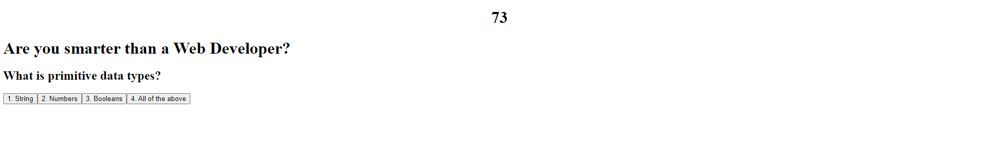

# Are you smarter than a Web Developer? (Mini-Quiz)

## Table of Contents
1. [Description](#Description)
 2. [Visual](#Visual)
 
## Description
 This is a quick and small quiz on Javascript, if you go though my quiz you will be sent through a few questions and when you get an answer wrong 10 seconds will be deducted from your score. Your score is based on how many seconds you have remaining. You can also check your score in the local storage of the website. Even if you refresh the page the score will still be stored there.
 Hope you have a great experience!

 ## Visual
 